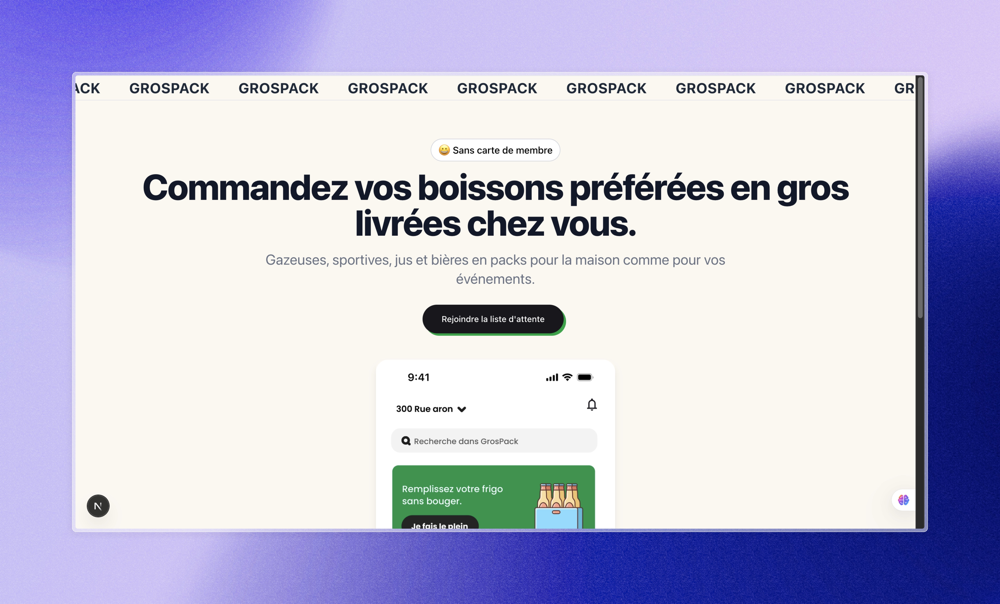

# Grospack - Landing Page

Grospack est une **Landing Page** conçue pour tester le marché, collecter des adresses courriel et valider l’intérêt des utilisateurs pour une application de commande de boissons en gros. Cette page permet aux visiteurs de s'inscrire à une liste d'attente.

---

## 🚀 Objectifs

- **Tester le marché** : Évaluer l'intérêt des utilisateurs pour le concept.
- **Collecter des adresses courriel** : Construire une base de prospects pour un futur lancement.
- **Valider l'intérêt** : Mesurer l'engagement des utilisateurs via les inscriptions.

---

## 🛠️ Technologies utilisées

- **Framework** : [Next.js](https://nextjs.org/) (React)
- **Base de données** : [PostgreSQL](https://www.postgresql.org/) via [Neon](https://neon.tech/)
- **ORM** : [Prisma](https://www.prisma.io/)
- **Validation des formulaires** : [Zod](https://zod.dev/)
- **UI** : Tailwind CSS
- **Gestion des états** : React Hooks
- **Gestion des erreurs** : [Sonner](https://sonner.dev/)

---
